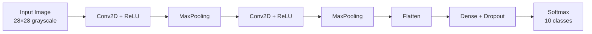

<div align="center">

# ✍️ Handwritten Digit Recognition

### Convolutional Neural Network for MNIST classification


</div>

A convolutional neural network trained on the **MNIST** dataset that recognizes
handwritten digits (0–9) with high accuracy. Implemented in Python with
TensorFlow/Keras as part of an undergraduate research project.

## 📰 Publication

This work was published as:

> **An Intelligent Way to Recognize Digits Using Convolutional Neural Networks**

## 🏗️ How it works



## 🚀 Quick start

```bash
pip install tensorflow numpy matplotlib
python train.py        # train the model on MNIST
python predict.py img.png  # classify a digit image
```

## 📊 Approach

- Preprocessing: normalize pixels to [0, 1], reshape to (28, 28, 1)
- Architecture: two Conv2D + MaxPooling blocks → Flatten → Dense (128) → Dropout → Softmax (10)
- Loss: categorical cross-entropy. Optimizer: Adam.
- Evaluation: accuracy on the held-out MNIST test set

## 📜 License
MIT
